# Documentation Générale de l'Application MovieLib

## Vue d'ensemble

MovieLib est une application Electron permettant de gérer une bibliothèque de films locale, enrichie par des métadonnées récupérées depuis des bases de données externes (ex: TMDB, IMDB). L'architecture suit une séparation stricte entre le domaine métier (use cases, ports) et les adapters (accès système, communication, etc.), inspirée par les principes de l'architecture hexagonale (Ports & Adapters).

## Architecture Générale

- **Renderer (UI)** : Interface utilisateur développée en React. Elle communique avec le backend Electron via IPC.
- **Electron Main Process** : Contient la logique métier, les use cases, et les adapters pour accéder au système de fichiers, à la configuration, aux métadonnées, etc.
- **Adapters** : Fournissent des implémentations concrètes pour les ports (interfaces) du domaine : accès fichiers, HTTP, base de données de films, etc.
- **Use Cases** : Encapsulent la logique métier (ajout, organisation, récupération de films, gestion de la configuration, etc.).
- **Ports (Interfaces)** : Définissent les contrats d'accès aux ressources externes ou services.

## Diagramme d'architecture

```mermaid
flowchart TD
  subgraph Electron Main Process
    IPCRouterAdapter["IPCRouterAdapter\n(IPC Adapter)"]
    FileSystemAdapter["FileSystemPort\n(Impl)"]
    MetadataAdapter["MetadataAdapterPort\n(Impl)"]
    MovieDBAdapter["MovieDBAdapterPort\n(Impl)"]
    HttpAdapter["HttpPort\n(Impl)"]
    ConfigurationAdapter["ConfigurationPort\n(Impl)"]
  end

  subgraph UseCases
    CleanLocalMovie["CleanLocalMovieWithSelectedMovieUseCase"]
    GetMovie["GetMovieUseCase"]
    GetMovieMetadata["GetMovieMetadataUseCase"]
    GetMovieImage["GetMovieImageUseCase"]
    ListMoviesByTitleOnDB["ListMoviesByTitleOnDBUseCase"]
    ListNewMovies["ListNewMoviesUseCase"]
    SearchAndAddNewMovies["SearchAndAddNewMoviesUseCase"]
    InitializeNewLibrary["InitializeNewLibraryUseCase"]
    FirstInitialization["FirstInitializationUseCase"]
    SaveConfiguration["SaveConfigurationUseCase"]
    GetConfiguration["GetConfigurationUseCase"]
    SelectLibraryFolder["SelectLibraryFolderUseCase"]
  end

  subgraph Renderer
    UI["UI (React)"]
  end

  UI -- IPC --> IPCRouterAdapter
  IPCRouterAdapter -- Appelle --> CleanLocalMovie
  IPCRouterAdapter -- Appelle --> GetMovie
  IPCRouterAdapter -- Appelle --> GetMovieMetadata
  IPCRouterAdapter -- Appelle --> GetMovieImage
  IPCRouterAdapter -- Appelle --> ListMoviesByTitleOnDB
  IPCRouterAdapter -- Appelle --> ListNewMovies
  IPCRouterAdapter -- Appelle --> SearchAndAddNewMovies
  IPCRouterAdapter -- Appelle --> InitializeNewLibrary
  IPCRouterAdapter -- Appelle --> FirstInitialization
  IPCRouterAdapter -- Appelle --> SaveConfiguration
  IPCRouterAdapter -- Appelle --> GetConfiguration
  IPCRouterAdapter -- Appelle --> SelectLibraryFolder

  CleanLocalMovie -- Utilise --> MovieDBAdapter
  CleanLocalMovie -- Utilise --> FileSystemAdapter
  CleanLocalMovie -- Utilise --> MetadataAdapter
  CleanLocalMovie -- Utilise --> ConfigurationAdapter
  CleanLocalMovie -- Utilise --> HttpAdapter

  GetMovie -- Utilise --> GetMovieMetadata
  GetMovie -- Utilise --> ConfigurationAdapter

  GetMovieMetadata -- Utilise --> FileSystemAdapter
  GetMovieMetadata -- Utilise --> MetadataAdapter
  GetMovieMetadata -- Utilise --> ConfigurationAdapter

  GetMovieImage -- Utilise --> FileSystemAdapter
  GetMovieImage -- Utilise --> ConfigurationAdapter

  ListMoviesByTitleOnDB -- Utilise --> MovieDBAdapter

  ListNewMovies -- Utilise --> FileSystemAdapter
  ListNewMovies -- Utilise --> ConfigurationAdapter

  SearchAndAddNewMovies -- Utilise --> GetMovieMetadata
  SearchAndAddNewMovies -- Utilise --> ListNewMovies
  SearchAndAddNewMovies -- Utilise --> ConfigurationAdapter

  InitializeNewLibrary -- Utilise --> GetMovieMetadata
  InitializeNewLibrary -- Utilise --> ListNewMovies
  InitializeNewLibrary -- Utilise --> ConfigurationAdapter

  FirstInitialization -- Utilise --> ConfigurationAdapter
  SaveConfiguration -- Utilise --> ConfigurationAdapter
  SaveConfiguration -- Utilise --> InitializeNewLibrary
  GetConfiguration -- Utilise --> ConfigurationAdapter
  SelectLibraryFolder -- Utilise --> UI
```

## Explications complémentaires

- **IPC (Inter-Process Communication)** : Permet à l'UI (renderer) de déclencher des actions côté main process (backend) via l'adapter IPCRouterAdapter.
- **Use Cases** : Chaque action métier (ajout, organisation, récupération de films, etc.) est encapsulée dans un use case dédié, ce qui facilite la maintenance et les tests.
- **Ports & Adapters** : Les use cases n'ont connaissance que des interfaces (ports), ce qui permet de remplacer facilement les implémentations concrètes (adapters) pour le système de fichiers, la configuration, les accès externes, etc.
